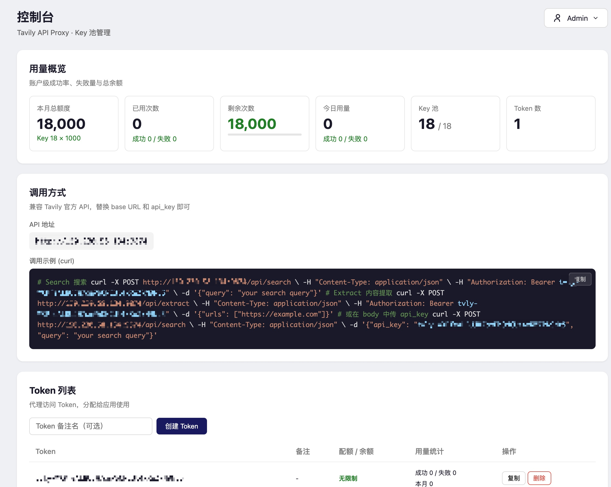
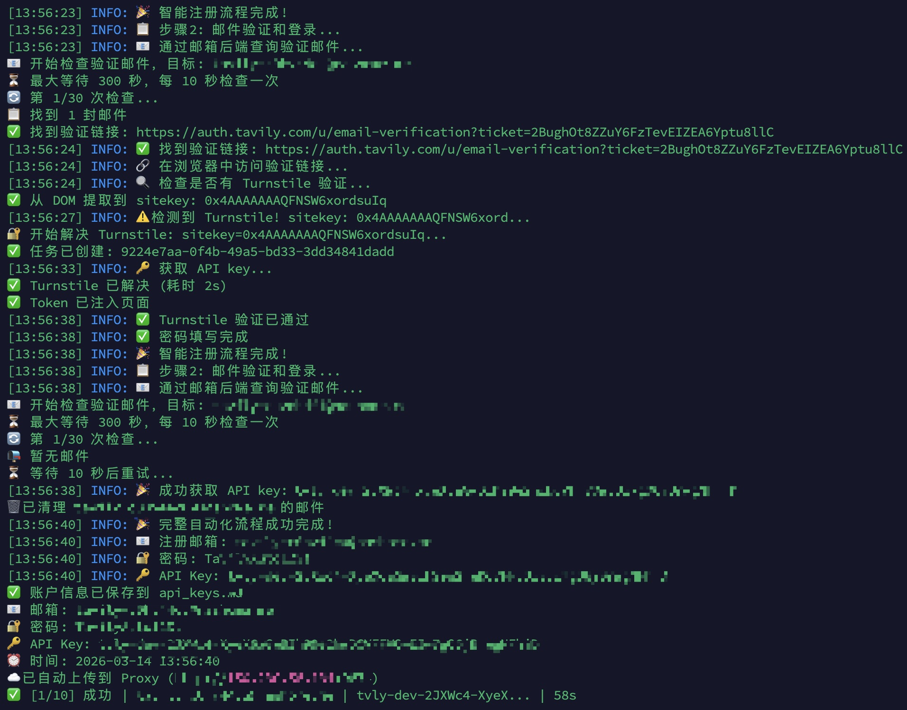

# Tavily Key Generator + API Proxy

批量注册 Tavily 账户获取 API Key，并通过代理网关池化管理，对外提供统一 API 端点。

## 功能概览

| 模块 | 说明 |
|------|------|
| **Key Generator**（根目录） | 自动批量注册 Tavily 账户，获取 API Key |
| **API Proxy**（`proxy/`） | 将多个 Key 池化，统一出口 + Web 控制台 |

## 截图

### Web 控制台



### 自动注册流程



---

## API Proxy（代理网关）

将多个 Tavily API Key 池化，对外暴露统一端点和 Token，附带 Web 管理控制台。

### 功能

- **Key 池化轮询**：Round-robin 分配请求，连续失败 3 次自动禁用
- **Token 管理**：创建访问 Token，兼容 Tavily 官方 `tvly-` 格式
- **用量统计**：实时查看总额度、已用/剩余次数，新增 Key 自动增加额度
- **Web 控制台**：可视化管理 Key、Token 和用量，内置 API 调用示例
- **批量导入**：支持从 `api_keys.md` 格式文本批量导入 Key
- **兼容 Tavily 官方 API**：客户端只需改 base URL 即可

### Docker 部署

```bash
cd proxy/
cp .env.example .env
# 编辑 .env 中的 ADMIN_PASSWORD
docker compose up -d
```

服务运行在 `http://localhost:9874`，访问 `/console` 进入管理控制台。

### 使用方式

1. 访问 `http://your-server:9874/console`，输入管理密码登录
2. 导入 Tavily API Key（支持单个添加或批量导入）
3. 创建 Token，复制 Token
4. 在应用中调用代理：

```bash
# Search
curl -X POST http://your-server:9874/api/search \
  -H "Authorization: Bearer tvly-YOUR_TOKEN" \
  -H "Content-Type: application/json" \
  -d '{"query": "hello world"}'

# Extract
curl -X POST http://your-server:9874/api/extract \
  -H "Authorization: Bearer tvly-YOUR_TOKEN" \
  -H "Content-Type: application/json" \
  -d '{"urls": ["https://example.com"]}'
```

也可以在 body 中传 `api_key` 字段，与 Tavily 官方 SDK 用法一致。

### API 参考

**代理端点**（需要 Token 认证）：

| 方法 | 路径 | 说明 |
|------|------|------|
| POST | `/api/search` | 代理 Tavily Search API |
| POST | `/api/extract` | 代理 Tavily Extract API |

**管理端点**（需要 `X-Admin-Password` 请求头）：

| 方法 | 路径 | 说明 |
|------|------|------|
| GET | `/console` | Web 管理控制台 |
| GET | `/api/stats` | 用量统计概览 |
| GET/POST | `/api/keys` | 列出/添加 Key |
| DELETE | `/api/keys/{id}` | 删除 Key |
| PUT | `/api/keys/{id}/toggle` | 启用/禁用 Key |
| GET/POST | `/api/tokens` | 列出/创建 Token |
| DELETE | `/api/tokens/{id}` | 删除 Token |
| PUT | `/api/password` | 修改管理密码 |

---

## Key Generator（批量注册）

自动批量注册 Tavily 账户并获取 API Key。

### 功能

- Playwright 浏览器自动化，全流程无人值守
- 自动解决 Cloudflare Turnstile 验证码（CapSolver API）
- 自动接收验证邮件并完成邮箱验证
- 可插拔邮箱后端：Cloudflare Email Worker / DuckMail
- 多线程并行注册，带冷却间隔防风控
- 注册成功后自动上传到 Proxy 网关

### 快速开始

```bash
git clone https://github.com/skernelx/tavily-key-generator.git
cd tavily-key-generator
pip install -r requirements.txt
playwright install firefox
cp config.example.py config.py
# 编辑 config.py 填写配置
python main.py
```

### 配置说明

#### 验证码（必配）

Tavily 注册页使用 Cloudflare Turnstile 验证码：

| 模式 | 配置值 | 成本 | 成功率 | 说明 |
|------|--------|------|--------|------|
| **CapSolver** | `"capsolver"` | ~$0.001/次 | **高** | **推荐**，稳定可靠 |
| 浏览器点击 | `"browser"` | 免费 | 低 | 容易被检测，仅供尝试 |

```python
CAPTCHA_SOLVER = "capsolver"
CAPSOLVER_API_KEY = "CAP-xxx"   # 从 capsolver.com 获取
```

#### 邮箱后端（必配）

需要一个能接收邮件的后端来获取验证链接，二选一：

**方案 A：Cloudflare Email Worker**（自建，免费）

```python
EMAIL_DOMAIN = "example.com"
EMAIL_API_URL = "https://mail.example.com"
EMAIL_API_TOKEN = "your-token"
```

**方案 B：DuckMail**（第三方临时邮箱）

```python
DUCKMAIL_API_BASE = "https://api.duckmail.sbs"
DUCKMAIL_BEARER = "dk_xxx"
DUCKMAIL_DOMAIN = "duckmail.sbs"
```

配置了多个后端时，运行时会提示选择；只配置一个则自动使用。

#### 自动上传到 Proxy（可选）

注册成功后自动将 API Key 推送到 Proxy 网关：

```python
PROXY_AUTO_UPLOAD = True
PROXY_URL = "http://your-server:9874"
PROXY_ADMIN_PASSWORD = "your-password"
```

---

## 注意事项

### 风控与频率限制

- **注册频率**：Tavily 有 IP 级别的风控机制，注册过快会导致后续请求全部失败。默认冷却间隔 45 秒 + 随机抖动，**不建议调低**
- **并行线程**：默认 2 线程，**不建议超过 3 线程**。线程越多触发风控的概率越高
- **IP 封禁**：同一 IP 短时间内大量注册会被临时封禁，建议单次批量不超过 20 个，间隔一段时间后再继续
- **浏览器指纹**：使用 Firefox 无头模式，已做基本反检测处理，但不保证长期有效
- **验证码失败**：如果频繁出现验证码失败，说明可能触发了更高级别的风控，建议暂停一段时间（数小时）后重试

### 免费额度

- 每个 Tavily 免费账户有 **1000 次/月** API 调用额度
- Proxy 控制台会自动计算总额度（活跃 Key 数 × 1000）
- 添加新 Key 后总额度自动增加，禁用/删除 Key 后自动减少

### 安全建议

- 部署 Proxy 后务必**修改默认管理密码**（可在控制台右上角修改）
- 建议配合 Nginx 反向代理 + HTTPS 使用
- 不要将 `config.py` 提交到公开仓库（已在 `.gitignore` 中）

## License

MIT
